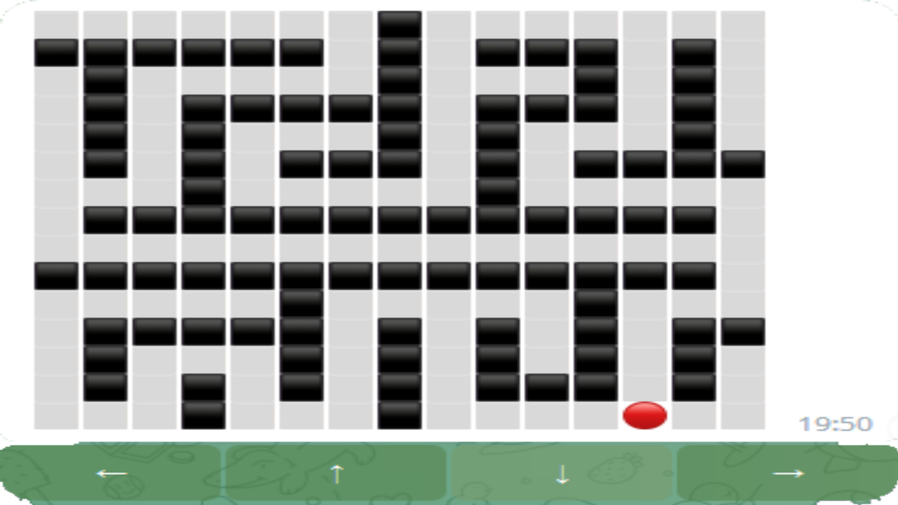
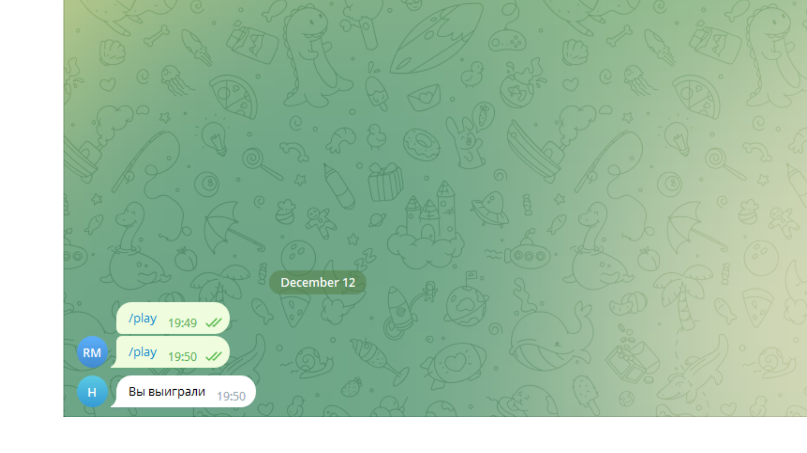

# Лабиринт

1. Бот отвечает на команды:
* /play - запустить новую игру;
2. Для каждого пользователя сохраняется  лабиринт, а также координаты игрока.
Функция  get_map_str  получает карту и координаты игрока, а возвращает строку с сообщением.
Переменная keyboard отвечает за создание кнопок направления движения.
Функция  сallback_func  вызывается по нажатию на кнопку движения она получает лабиринт и старые координаты игрока
определяет новые координаты и проверяет возможность такого хода и сохраняет новые данные и изменяет сообщение. 
После прохождения лабиринта выводиться надпись вы выиграли. 
Для этого есть проверка, которая проверяет находиться ли пользователь в самой нижней правой ячейке.

Также для работы бота необходимо иметь установленную библиотеку 
[python-telegram-bot](https://python-telegram-bot.org/). 
Для её установки воспользуйтесь командой:
`pip install python-telegram-bot`

