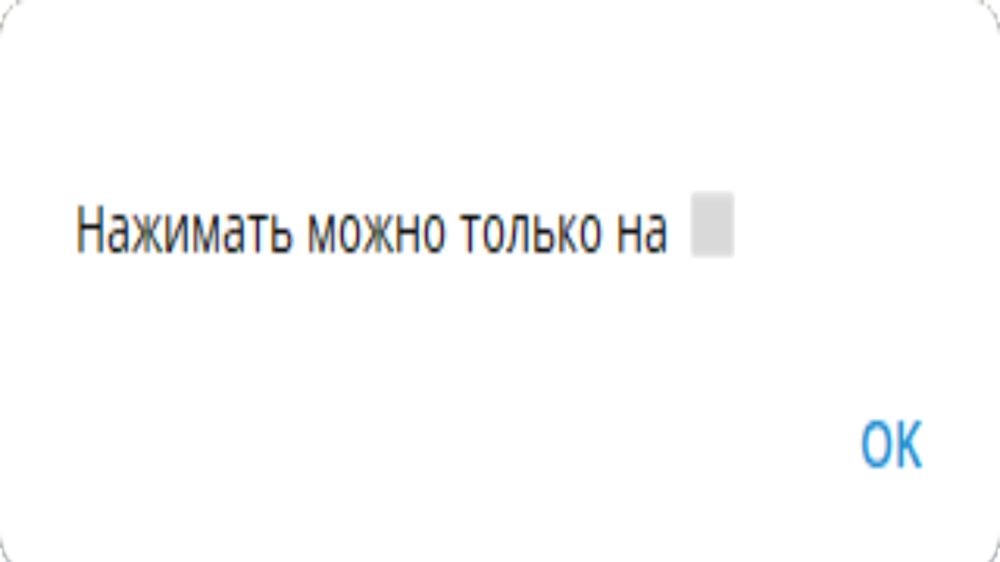
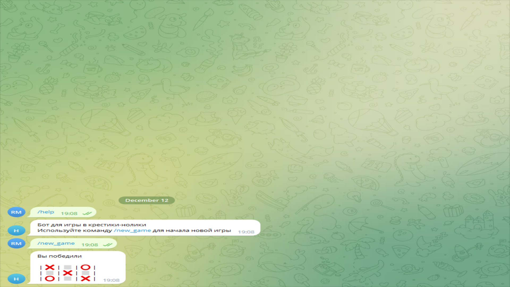

# Игра крестики нолики.
1.Бот отвечает на команды:
* /new_game - запустить новую игру;
2.Для того, чтобы не использовать базу данных, бот работает исключительно с callBackData, которую получает при нажатии на кнопку. 
Для этого, каждая кнопка хранит в себе следующую строку следующего формата: `n?????????`, где
* `n` - номер кнопки,
* `?` - один из вариантов значения ячейки
Пользователь играет за крестик, бот играет за нолик.
Есть проверка для хода пользователя есле пытаться сходить два раза в одну и туже ячейку.

Если ячейка, в которую хочет сходить пользователь свободна, то осуществляется ход, а затем выполняется проверка: не стал ли ход победным. 
Если нет, то наступает очередь бота ходить. Ячейка выбирается случайным образом, после чего проверяется не стал ли этот ход победным для бота. 
Дальше проверяется не получилась ли ничья, после чего редактируется сообщение.
После окончания игры кнопки пропадают, а на их месте появляется табличка с результатом партии.

Также для работы бота необходимо иметь установленную библиотеку 
[python-telegram-bot](https://python-telegram-bot.org/). 
Для её установки воспользуйтесь командой:
`pip install python-telegram-bot`

#
